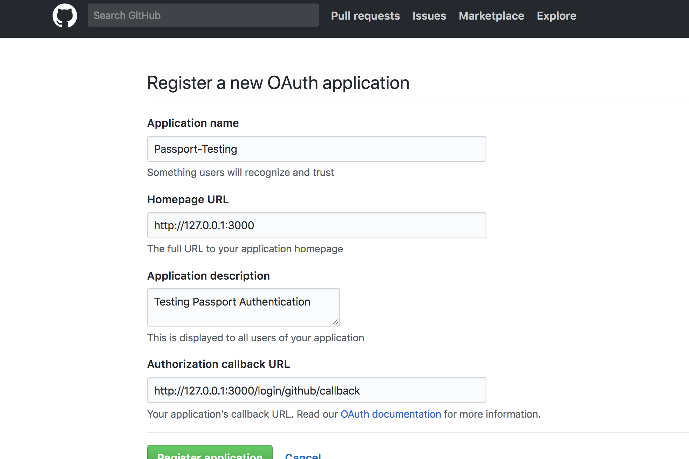

# Passport.js

## What is Passport?
An authentication library. It doesn't handle hashing passwords or sessions, but links to node session library and express. The official documentation is just ok, so look at other respositories on GitHub for strategies.

## Strategies
This is the first thing to figure out when setting up user authentication.
1. Basic/Local: Stores user information into your own database.

2. OAuth: Authentication happens on someone else's server. We will use this strategy with GitHub, which is also largely applicable to Google's.

These are located in the auth_strategies folder. 

*The package.json file shows that we are using passport-github and passport-local dependencies.
We also need cookie-parser and express-session dependencies.*

#### Basic/Local Strategy
The local.js file in auth_strategies contains a function to figure out if username and password are correct. This repository is set-up to work with MySql/Sequelize, but it can be altered to work with Mongo/Mongoose.

#### OAuth Strategy
Github OAuth will only work for people with github accounts. It may be better to use google or facebook. It's easier to use different OAuth providers together than to use local and an OAuth together.

To use OAuth, you need to register your with with your authenticator. For GitHub, login to GitHub > Settings > register your app with them, then they will authenticate your users for you (the same is true for other provides like Google, Facebook, etc.). Homepage URL has to be 127.0.0.1 for local. We think. Maybe.

Then, set up a .env file with this info from GitHub after registering app:
CLIENT_ID=
CLIENT_SECRET=

## Models
In models/user.js, define the information you want to store in the DB. `paranoid:true` will create a deletedAt column in the table, and simply log the delete information rather than completely removing a user from the database.

## Routes
routes/authentication-routes.js pairs with Basic/Local strategy, and routes/github-authentication pairs with OAuth strategy.

#### authentication-routes.js (Basic/Local strategy)
The module exports form can be changed, but must still contain username and password inputs to link with the rest of the authentication. 

>"`passport.authenticate()` is the magic of logging in." -Joe Kanter

`passport.authenticate('local')` will use the local strategy. The function after passport.authenticate is where you change what will be sent back You will probably want to put in a redirect to their next page or "true" to display the rest of the page if it's a single page app (currently it returns a json file from the database, including their username and password).

Be careful about order; initialize, then session, then routes. This is correct in this repository, so just copy everything within the 'boilerplate' comments. Don't touch it. Seriously. Joe worked really hard on it. Also, only the route(s) corresponding to your strategy need to be present.

#### github-authentication-routes.js (OAuth strategy)
"`passport.authenticate('github')` will use the GitHub OAuth strategy. The '/login/github' route will redirect to github's authentication. The user will the login directly on GitHub's website. If authenticated, it will redirect back to a route you define in github.js > const strategy{ callbackURL: }. Otherwise it will redirect back to the Homepage URL defined in the GitHub OAuth registration (some others allow you to define something else).

## passport-init.js
Change the `secret` to a random long-ish string. It uses this to create your session ids, but you don't need to remember this. Change `passport.use` to require the correct auth_strategies file (local.js for local, or github.js for github OAuth). Serializing shuts down a session and stores info to persistent storage, and deserialization pulls info from persistent storage when a new session is started (user logs in). If not using MySql/Sequelize, you will need to change the db syntax in `const deserializeUser` to match your db.

# A Practical Note of Great Import
`req.user` will be filled in for you (an object containing all the user information stored in the database) after setting up passport. Rest of your team/you can then access user information from db with `req.user.whateverPropertyYouWantFromDB`.

## More Sundry Information

'/login' route will show what is being returned from DB. '/logout' get request will logout.

If using React, use response from ajax call to change state and determine if rest of page will display or incorrect login information will display.

